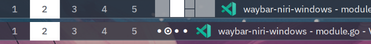

# waybar-niri-windows

waybar-niri-windows is a simple focus indicator and window minimap for
[Waybar](https://github.com/Alexays/Waybar) and
[niri](https://github.com/niri-wm/niri), a relatively new scrollable tiling
window manager. It is (regrettably) written in Go via C FFI to interface with
Waybar and GTK, and uses niri's IPC mechanisms to get information about the
windows on the current workspace.

The original project was a text-based indicator that didn't require CGo; a
version 2 was later written to allow for a more graphical representation and
mouse interaction with the minimap. This move to CGo turned subsecond compile
times into 15+ minute cold builds, which has convinced me to never use CGo in
new projects again, but it's still a fun project to work on nonetheless (if I
have time to spare sitting around).

Amazingly, quite a number of people have found this module useful, and it has
even been added to [awesome-niri](https://github.com/niri-wm/awesome-niri) for
its utility for Waybar users.
